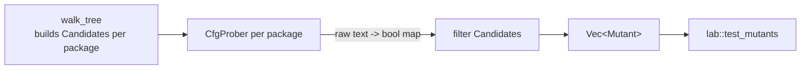
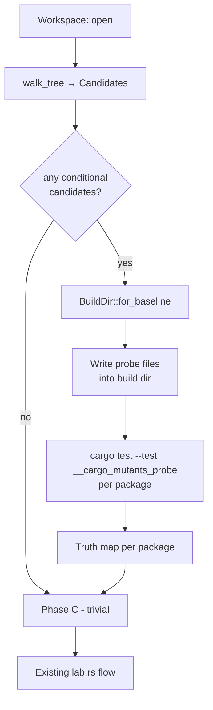

# Design: Obey `#[cfg(..)]` and `#[cfg_attr(..)]` attributes

Status: **Draft** (under review).

Related issues / docs:

- [`book/src/limitations.md`](../book/src/limitations.md) ("cargo-mutants does not yet understand conditional compilation")
- [`book/src/stability.md`](../book/src/stability.md) ("cfg and cfg_attr predicates are not currently evaluated…")
- [`book/src/attrs.md`](../book/src/attrs.md) ("`cargo-mutants` does not evaluate the `cfg_attr` condition")
- Upstream issue [sourcefrog/cargo-mutants#50](https://github.com/sourcefrog/cargo-mutants/issues/50).
- Assumes the [`exclude-re-attr` branch](../src/visit.rs) is already merged (introduces the `exclude_re` scope stack on `DiscoveryVisitor`).

---

## 1. Problem

`cargo-mutants` parses Rust source with `syn` but treats `#[cfg(...)]` and
`#[cfg_attr(...)]` as opaque tokens. Today this produces two related defects:

1. **Mutants in dead code.** Code gated behind `#[cfg(target_os = "linux")]`
   on Windows is still mutated; the mutant can never be exercised by tests, so
   it is always reported as `MISSED`/`UNVIABLE`. This is documented as a known
   bug in `book/src/limitations.md`.
2. **Unconditional honouring of `cfg_attr(..)` attributes.** `#[cfg_attr(any(),
   mutants::skip)]` skips the item even though `any()` is always false. The
   same applies to `#[cfg_attr(EXPR, mutants::exclude_re("…"))]`. This is
   documented in `book/src/attrs.md`.

We want cargo-mutants to behave **as if the Rust compiler had filtered the
AST**: only consider items that the compiler would actually compile in the
build profile that cargo-mutants runs, and only honour `mutants::*` attributes
that the compiler would actually attach.

### Constraint: do not re-implement rustc's cfg machinery

Rustc's set of built-in cfg flags evolves between releases (e.g.
`target_has_atomic="128"`, `target_abi`, `relocation_model`, future stable
flags). It also reflects the user's profile (`debug_assertions`,
`panic="unwind"`), `[target.'cfg(…)']` resolution in Cargo, custom
`--cfg foo` from `rustflags`, etc. We must not embed a hand-written copy of
this logic; the source of truth must remain the toolchain in use on the user's
machine.

---

## 2. Goals and non-goals

### Goals

- A mutant is generated only if **every** `#[cfg(EXPR)]` on an ancestor of the
  mutated node evaluates to **true** for the rustc invocation cargo-mutants
  would use.
- A `mutants::skip` / `mutants::exclude_re(…)` attribute nested in a
  `#[cfg_attr(EXPR, …)]` is honoured only when **EXPR** evaluates to **true**.
- Behaviour is correct for the **same Cargo invocation cargo-mutants will use
  to test mutants** — including `--features`, `--no-default-features`,
  `--all-features`, `--cargo-arg=--target=…`, custom `rustflags`, and the
  `mutants` profile.
- A `--ignore-cfg` opt-out preserves today's behaviour (treat every cfg as
  true, treat every nested attribute as active) for users who prefer it.
- No new build-time dependency on a hand-maintained cfg-evaluator crate.

### Non-goals (for v1)

- Resolving `#[cfg_attr(EXPR, path = "alt.rs")] mod foo;` (conditional module
  file paths). This is a different problem from cfg-gated module *inclusion*
  (which **is** supported — see §6.10): here the cfg controls which **file**
  the module resolves to, not whether the module is compiled. The current
  `find_path_attribute` (`src/visit.rs:949–972`) only matches the literal
  `#[path = "..."]` shape and silently ignores `cfg_attr`-wrapped variants,
  so today cargo-mutants fails to find the file and emits a missing-module
  warning. The new design preserves that behaviour — the same warning will
  still appear, and no mutants will be produced from the conditional file.
  Rationale for not fixing it now is in §6.10.1; it will be documented as a
  known limitation in `book/src/limitations.md`.
- Macro expansion (cargo-mutants is and remains a syntactic tool). In
  particular, the `cfg_select!` macro stabilised in Rust 1.95 is not
  handled — its arm bodies remain invisible to the visitor, the same as
  any other macro invocation today. To be reconsidered in a follow-up.
- **Cross-compilation.** If the user picks a `--target` that the host can't
  execute, cargo-mutants can't run the tests either and so can't perform
  meaningful mutation testing — the whole tool is already constrained to
  host-runnable targets (see `book/src/getting-started.md`:
  "Cross-compilation is not currently supported"). The probe inherits the
  same constraint, no extra fallback required.
- A user-facing API to *override* a single cfg value. Users still use
  `--features`, `--cargo-arg=--target=…`, etc.

---

## 3. Background: what is in scope

`syn` exposes any attribute that begins with `cfg(`, `cfg_attr(`, or any other
identifier. Today `attrs_excluded` in `visit.rs` looks at a tiny subset:

```
attrs_excluded = attr_is_cfg_test || attr_is_test || attr_is_mutants_skip
```

The new feature replaces this with a richer per-node analysis (kept in a stack
on `DiscoveryVisitor`, alongside the existing `exclude_re_stack`):

| Attribute                              | Existing behaviour | New behaviour                                       |
| -------------------------------------- | ------------------ | --------------------------------------------------- |
| `#[cfg(EXPR)]`                         | Ignored            | Add EXPR to the **must-be-true** stack              |
| `#[cfg(test)]` (any nesting of `test`) | Skip subtree       | Still skip subtree (orthogonal, see §6.1)           |
| `#[cfg_attr(EXPR, mutants::skip)]`     | Always skip        | Skip iff EXPR is true                               |
| `#[cfg_attr(EXPR, mutants::exclude_re("R"))]` | Always honour R | Honour R iff EXPR is true (push regex with guard) |
| `#[cfg_attr(EXPR, cfg(INNER))]`        | Ignored            | Push `all(EXPR, INNER)` onto must-be-true stack     |
| `#[cfg_attr(EXPR, ATTR_OF_NO_INTEREST)]` | Ignored          | Ignored                                             |

Conditions in the must-be-true stack are evaluated as the **conjunction** of
all enclosing scopes — they all have to hold for the node to be live.

---

## 4. High-level architecture

Discovery splits into **three phases**:

```
                +----------------------------+
                |  Phase A: collect          |
                |  candidates + conditions   |   (pure syntactic, per source file)
                +-------------+--------------+
                              |
                              v
                +----------------------------+
                |  Phase B: probe toolchain  |   (per package, runs cargo+rustc)
                |  for cfg truth values      |
                +-------------+--------------+
                              |
                              v
                +----------------------------+
                |  Phase C: filter           |   (in memory; trivial boolean)
                |  candidates -> Mutants     |
                +----------------------------+
```



### Phase A — candidate collection

`DiscoveryVisitor` is upgraded so that instead of immediately constructing a
`Mutant`, it constructs a `Candidate` that carries two small collections of
unevaluated cfg expressions:

```rust
/// Owned, normalised text of a single `cfg(…)` expression.
/// Stored as a string for simple deduplication and printing.
#[derive(Clone, Eq, PartialEq, Hash, Debug)]
struct CfgExpr(String);          // e.g. "target_os = \"linux\""

#[derive(Clone, Debug, Default)]
struct CfgConditions {
    /// All of these must evaluate to TRUE for the candidate to be live
    /// (one per enclosing `#[cfg(...)]` or `cfg_attr(...,cfg(...))`).
    must_be_true: Vec<CfgExpr>,
    /// All of these must evaluate to FALSE for the candidate to be live
    /// (e.g. ancestor `#[cfg_attr(EXPR, mutants::skip)]` would silence it
    /// when EXPR is true).
    must_be_false: Vec<CfgExpr>,
}

struct Candidate {
    mutant: Mutant,           // exactly today's Mutant
    conds: CfgConditions,
}
```

If both vectors are empty, the candidate is unconditionally live (this is the
common case — we want to keep the data path cheap when nothing is gated).

The visitor gains a small `cfg_stack: Vec<CfgConditions>` (or equivalently two
parallel stacks, mirroring `exclude_re_stack`). On entry to each item that can
carry attributes we **push** the conditions derived from its `#[cfg(...)]` and
`#[cfg_attr(...)]` attributes; on exit we pop. `collect_mutant` snapshots the
flattened stack into the `Candidate`'s `CfgConditions`.

### Phase B — probe the toolchain

For each package that contributed at least one *conditional* candidate, we
compile and execute a one-file probe in the workspace copy. The probe asks the
real rustc which conditions are true. Details in §5.

### Phase C — filter

```rust
fn is_live(c: &Candidate, truths: &HashMap<CfgExpr, bool>) -> bool {
    c.conds.must_be_true.iter().all(|e| truths[e])
        && c.conds.must_be_false.iter().all(|e| !truths[e])
}
```

Filtered survivors become the `Discovered.mutants` we already have today.
Everything downstream (`lab.rs`, `output.rs`, sharding, `--list`,
`--in-diff`, `--shuffle`, output JSON, etc.) is unchanged.

---

## 5. The probe mechanism

### 5.1 Why probe instead of asking `--print=cfg`?

`rustc --print=cfg` (and `cargo rustc -- --print=cfg`) is appealing — it
dumps the active cfg name/value pairs and we could evaluate expressions
ourselves with a small evaluator. **We deliberately reject this** for one
reason: the set of valid cfg *predicate forms* (`any`, `all`, `not`, `=`,
plus future-stable forms like `version("1.80")` or `accessible(…)`) is
controlled by rustc. A locally-maintained evaluator would inevitably lag,
and we'd ship a different boolean answer than the compiler.

By **putting the literal expression inside `#[cfg(EXPR)]` in synthesized
Rust** and asking rustc to compile it, we delegate parsing and evaluation
entirely to the compiler. Whatever rustc accepts in real code, the probe
accepts too — automatically, on whatever toolchain the user has.

### 5.2 Where to put the probe

A package has zero or more targets (lib, bin(s), examples, integration tests,
proc-macro). We need a target that:

1. Sees the **same `cfg`s** as the lib/bin code that contributed candidates
   (same active features, same `--target`, same `--cfg` flags). In Cargo,
   target/feature resolution is **per-package**, so any target in the same
   package and the same invocation will see the same active features and the
   same target cfgs.
2. Can be **executed** to emit observations.
3. Builds for **arbitrary** packages: `lib`, `bin`, `proc-macro`, `cdylib`,
   `no_std` libs, etc.

The chosen mechanism is an **integration test** added to the package by
writing a single file:

```
<build_dir>/<package_dir>/tests/__cargo_mutants_probe.rs
```

with content (per package, generated):

```rust
// AUTO-GENERATED by cargo-mutants. Do not edit.
// One println per distinct cfg expression observed in this package.

#[test]
fn __cargo_mutants_probe() {
    #[cfg(target_os = "linux")]
    println!("CMP|c0001|1");
    #[cfg(not(target_os = "linux"))]
    println!("CMP|c0001|0");

    #[cfg(feature = "foo")]
    println!("CMP|c0002|1");
    #[cfg(not(feature = "foo"))]
    println!("CMP|c0002|0");

    // ... etc
}
```

Why integration test (`tests/...`):

- Works for **any** kind of package (lib, bin, proc-macro, no_std, cdylib).
  An integration test is its own crate, defaulting to `std` and a `main`
  generated by the test harness. It links against the package's lib (or just
  stands alone for bin-only / proc-macro packages — it doesn't need to call
  into the package).
- Does **not** require modifying `lib.rs` / `main.rs` / `Cargo.toml`. The
  file just appears in the conventional `tests/` directory. Cargo auto-
  discovers it. (If `[[test]]` entries are explicitly listed and
  `autotests = false`, we fall back to writing an explicit `[[test]]` stanza;
  see §5.7.)
- Sees the same per-package features and target cfgs as the rest of the
  package's compilation.
- Runs under `cfg(test) = true`. This matches what cargo-mutants does during
  baseline / mutant test runs (`cargo test --no-run` for the build phase),
  so the truths it observes match what the mutant test runs will see.
- It is *added* (not a replacement), so it cannot accidentally break
  user-written code or shadow user-defined files.

Note: the probe never needs to *call* anything from the package under test —
it doesn't even need a `use my_crate;`. The integration test crate is purely
a host for cfg-gated `println!`s.

### 5.3 Cargo invocation

Per package, after writing the probe file into the **baseline build dir**
(which is the existing temp copy of the workspace):

```
cargo test \
    --manifest-path <build_dir>/Cargo.toml \
    --package <pkg>@<version> \
    --test __cargo_mutants_probe \
    --quiet \
    <baseline feature/profile/cargo-arg flags> \
    -- --nocapture --exact __cargo_mutants_probe
```

This **reuses every flag the regular baseline already uses** (`--features`,
`--no-default-features`, `--all-features`, `--profile=mutants`, `additional_cargo_args`,
`RUSTFLAGS`/`CARGO_ENCODED_RUSTFLAGS`). Implementation: factor `cargo_argv`
to expose a "shared prefix" and reuse it. This guarantees the cfgs we probe
are the cfgs that will be in effect when the mutant is built and tested.

We run via `cargo test` (not `cargo nextest run`) even when the user picked
nextest, because we control the test invocation and only need `cargo`'s
package selection + feature resolution; this avoids depending on nextest for
the probe and simplifies output parsing.

### 5.4 Output protocol

Stable, line-oriented, easy to grep:

```
CMP|<id>|<0|1>
```

- `CMP` literal sentinel ("cargo-mutants probe"), unlikely to collide.
- `<id>` is `c%04u`, a per-probe-run identifier we assign to each
  distinct `CfgExpr`. We keep a `Vec<CfgExpr>` so id → expr is recoverable.
- `<0|1>` is the observed truth value.

Parsing keeps only lines matching the regex `^CMP\|c\d+\|[01]$`; everything
else (cargo output, test harness noise) is ignored. Conditions with no
matching `CMP|…|0` and no `CMP|…|1` line are treated as **unknown** and we
fall back conservatively — see §6.3.

### 5.5 Per-package vs whole-workspace

One probe per package. Reasons:

- Features and `--target` are resolved per package; one probe per *workspace*
  could observe the wrong feature set for a given member.
- A package may contribute zero conditional candidates, in which case we skip
  its probe entirely and save build time.
- It maps naturally to the existing `walk_package` loop in `visit.rs`.

We deduplicate `CfgExpr`s within a package, so the per-package probe is
typically small (tens of cfgs at most).

### 5.6 When are probes built?



We **piggy-back on the baseline build dir** (we always create one unless
`--in-place`). The probes compile as part of the baseline test build (Cargo
caches their artifacts), so subsequent baseline `cargo test --no-run` runs
don't repeat that work. The marginal cost of a probe binary is small —
typically << 1 s on a warm cache because it contains nothing but
`println!`s under cfg gates.

Probe execution happens **before** the baseline test, between
`BuildDir::for_baseline()` and `Lab::run_baseline()`. Probes don't need the
real tests built, only their own tiny test binary.

### 5.7 Edge cases for placement

| Case                                                    | Strategy                                                                                        |
| ------------------------------------------------------- | ----------------------------------------------------------------------------------------------- |
| Package's `Cargo.toml` has `autotests = false`          | Append an explicit `[[test]] name = "__cargo_mutants_probe" path = "tests/__cargo_mutants_probe.rs"` to the build-dir copy of `Cargo.toml`. |
| Package has no `tests/` directory                       | Create it.                                                                                      |
| Package already has a `tests/__cargo_mutants_probe.rs`  | **Hard error.** The name is reserved; an existing file almost certainly indicates a corrupted working copy left over from an interrupted run, and silently overwriting (or working around with a suffix) would mask that. The message tells the user to delete the stray file. |
| `--in-place` (no build dir copy)                        | Write the probe directly into the user's tree, run it, delete it. Reuse the existing `--in-place` interrupt-cleanup machinery so the probe (and any `Cargo.toml` edit for `autotests = false`) is reverted on Ctrl-C / panic. See §6.5 for the full lifecycle. |
| Proc-macro package                                      | Integration tests are allowed; they run on host. Resulting cfgs are *host* cfgs, which is what applies to proc-macro source. ✓ |
| `no_std` lib                                            | Integration test binaries do not inherit `#![no_std]`; they get `std` and `println!` as normal. ✓ |
| Package only has `#[cfg(all())]` etc. (always true)     | Still emit a `CMP|…|1` line — uniform handling.                                                 |

---

## 6. Detailed behaviour

### 6.1 Relationship to today's `cfg(test)` rule

Today `attr_is_cfg_test` *always* skips a subtree whose cfg mentions `test`.
This is a **separate** policy ("don't mutate test code") and survives
unchanged: we keep that early `return` in each `visit_*`. The new must-be-
true / must-be-false stacks therefore never see `cfg(test)` expressions, and
the probe never reports on them. (This avoids a subtle confusion: cargo-mutants
builds with `cargo test --no-run`, so `cfg(test)` is true at build/test
time — applying the new "must be true to be live" rule would *invert*
today's behaviour for `cfg(not(test))` code. We explicitly do **not** want
that change as part of this feature.)

### 6.2 Combining `cfg_attr` with multiple attributes

`#[cfg_attr(EXPR, attr1, attr2, attr3)]` distributes to "if EXPR then apply
each of attr1/attr2/attr3". For each interesting inner attribute we synthesise
the same condition `EXPR`:

| Inner attribute            | Effect on stacks                                  |
| -------------------------- | ------------------------------------------------- |
| `cfg(INNER)`               | push `all(EXPR, INNER)` to **must-be-true**       |
| `mutants::skip`            | push `EXPR` to **must-be-false** (live iff !EXPR) |
| `mutants::exclude_re("R")` | push `(EXPR, RegexSet::from("R"))` onto `exclude_re_stack` as a *conditional* entry (see §6.6) |

Nested `cfg_attr(A, cfg_attr(B, mutants::skip))` becomes `all(A, B)` on the
must-be-false stack. The visitor handles this recursively while parsing
attributes; the rest of the pipeline only ever sees flat `CfgExpr`s.

### 6.3 Probe failure modes

The probe can fail to compile or run:

1. **Probe contains a cfg expression rustc rejects** (e.g. an unstable
   `version(…)` form on stable, or a malformed user attribute that
   `--cap-lints` no longer hides). We fall back to **conservative defaults**
   for that package:
   - `must_be_true` conditions: treat as **true** (keep the candidate live).
   - `must_be_false` conditions: treat as **false** (keep the candidate live).
   - Warn once per package with the cargo output and tell the user to pass
     `--ignore-cfg` or fix the attribute.

   *Conservative* here means "behave like today" — we never silently *delete*
   mutants because the probe broke.

2. **Package has compile errors entirely** (which would also break the
   baseline). Same outcome as today — baseline fails, cargo-mutants aborts;
   nothing new to handle.

Cross-compilation (probe builds but cannot run on the host) is not handled
specially: cargo-mutants already requires a host-runnable target, since it
needs to execute the real test suite. The probe inherits the same constraint.

### 6.4 Interaction with `--list`, `--list-files`, `--json`

Today `--list` does no build; it walks source and prints mutants. To keep
listings accurate, `--list` runs the probe pipeline by default. For users
who want the old fast listing, `--ignore-cfg` skips the probe entirely.

`--list-files` is unchanged: see §6.10 for the rules on which mod files we
walk into.

### 6.5 Interaction with `--in-place`

`--in-place` runs cargo against the user's tree without copying. Per
[`book/src/in-place.md`](../book/src/in-place.md), this is a workflow that
**already accepts cargo-mutants modifying the user's source tree** — it
applies and reverts mutations in place for every mutant, and the docs
direct users to either work in a disposable checkout or review diffs
before committing.

Given that contract, the probe is allowed under `--in-place`: it is
strictly less invasive than the mutation cycle that already happens (one
file written once at the start of discovery, deleted at the end, versus
per-mutant edit/revert churn across the whole tree).

Lifecycle under `--in-place`:

1. Discovery starts. We write `tests/__cargo_mutants_probe.rs` (and, if
   the package has `autotests = false`, append the explicit `[[test]]`
   stanza to `Cargo.toml` — see §5.7).
2. The probe file is registered with the same interrupt-cleanup machinery
   cargo-mutants already uses to revert in-place mutations on Ctrl-C /
   panic, so it is deleted (and `Cargo.toml` reverted) even on abnormal
   termination.
3. We invoke `cargo test --test __cargo_mutants_probe` once per package.
4. We parse the output and free the probe: delete the file and revert the
   `Cargo.toml` edit if one was made.
5. Discovery proceeds with the resulting cfg evaluations; mutation testing
   is unaffected from this point on.

Why this is acceptable:

- The probe file has a deliberately namespaced name
  (`__cargo_mutants_probe.rs`), making it easy to spot if it ever does
  leak into `git status`.
- The most common `--in-place` use case is **CI on a disposable
  checkout**, where leftover artefacts are inconsequential by definition.
  Hard-erroring here would force the canonical `--in-place` user into
  `--ignore-cfg`, defeating the cfg-obeying feature for the user who most
  benefits from accurate per-target mutant lists.
- The `Cargo.toml` edit for `autotests = false` is the riskiest part of
  this path. It is rare in practice (most packages keep the default), and
  the revert is symmetric with the file deletion — both go through the
  same cleanup handle.

What we still refuse:

- If a `tests/__cargo_mutants_probe.rs` **already exists** in the user's
  tree at discovery start, we hard-error regardless of `--in-place` (see
  §5.7). This indicates either a name collision (extraordinarily
  unlikely) or a corrupted working copy from an interrupted previous run
  — in the latter case the user should delete the stray file before
  retrying.

Users who do not want any probe file to ever touch their tree can pass
`--ignore-cfg`, which skips Phase B entirely (§6.3).

### 6.6 Interaction with the `exclude-re-attr` feature

The existing `exclude_re_stack: Vec<RegexSet>` is generalised to carry an
optional guard expression:

```rust
struct ExcludeReScope {
    /// When None, regex is unconditionally active (today's behaviour).
    /// When Some(expr), regex is only active when expr evaluates to true.
    guard: Option<CfgExpr>,
    set: RegexSet,
}
```

`excluded_by_attr_re` becomes a per-candidate check that consults
`CfgConditions` to know which scopes are live. Equivalently — and probably
simpler to implement — we postpone the regex check until Phase C, so we just
attach the (guard, set, mutant name) tuples to the candidate and evaluate
them all once we know which conditions are true.

### 6.7 Interaction with package selection, sharding, in-diff

These all operate on the post-filter `Vec<Mutant>`, so no changes are
required:

- **Sharding** sees only live mutants → sharding is **deterministic** but its
  output is now platform-sensitive. This is the intended new behaviour: a
  shard on Linux runs the Linux-only mutants, and equivalently for Windows.
  We document this in `book/src/shards.md`.
- **`--in-diff`** continues to filter against the post-probe set. A diff that
  touches Windows-only code will, on Linux, simply yield zero new live
  mutants — which is again the correct, intended behaviour.
- **`--previously-caught`** is unaffected; it filters by mutant *name* and
  names are unchanged.

### 6.8 Interaction with the `mutants` profile

`[profile.mutants]` (currently `inherits = "test"`, `debug = "none"`) is
passed through `--profile=mutants` for cargo builds. The probe uses the same
profile, so any cfgs that depend on `debug_assertions` evaluate consistently
with the real builds.

### 6.9 Configuration surface

Added to `Args` and `Config`:

| Flag                  | Default | Effect                                                       |
| --------------------- | ------- | ------------------------------------------------------------ |
| `--ignore-cfg`        | off     | Disable the entire feature: treat all cfgs as `true`, all `cfg_attr` predicates as `true`. Reproduces pre-feature behaviour. |
| `ignore_cfg = true` (`.cargo/mutants.toml`) | unset | Same as `--ignore-cfg`. |

Obeying cfg is **on by default** as soon as this feature lands — see §9.

### 6.10 Conditional `mod foo;` statements

The current behaviour (post the `exclude-re-attr` branch, which doesn't
change this) for a `mod foo;` that has attributes:

| Source                                       | Today's behaviour                                     |
| -------------------------------------------- | ----------------------------------------------------- |
| `mod foo;`                                   | Load `foo.rs`; generate mutants from it.              |
| `#[cfg(test)] mod foo;`                      | **Skipped** (via `attr_is_cfg_test` in `attrs_excluded`); `foo.rs` is never opened or walked. |
| `#[cfg(target_os = "linux")] mod foo;`       | Walked unconditionally; mutants generated from `foo.rs` as if it were always compiled. (This is the bug we're fixing.) |
| `#[cfg_attr(any(), mutants::skip)] mod foo;` | **Skipped** (via `attr_is_mutants_skip` in `attrs_excluded`), even though `any()` is never true. (Bug.) |

Concretely: `visit_item_mod` calls `attrs_excluded(&node.attrs)` and returns
early if the result is true. `attrs_excluded` only matches the three
specific patterns above (`cfg(test)`, `#[test]`-like, `mutants::skip`); any
other `cfg(...)` predicate on the `mod` falls through to the normal walk,
which pushes the mod onto `external_mods` and later loads its file. The cfg
gate on the `mod` statement is thrown away.

**New behaviour proposed for v1:** keep walking into the mod file regardless
of its `#[cfg(EXPR)]`, but **propagate `EXPR` onto every candidate produced
from inside that file** (it joins the must-be-true stack while we walk the
mod's children). This falls out of the stack-based design for free.
Consequence: if the cfg evaluates to false, every candidate from inside
gets filtered out in Phase C, so the mod contributes zero mutants — which
is the correct outcome. The file still counts as "visited" for
`--list-files`, matching today's reporting.

We deliberately do *not* skip walking the file outright in v1, because:

- It would change `--list-files` output in a user-visible way.
- It would prevent us from discovering transitively referenced `mod` files
  (i.e. files that may be referenced from inside a cfg-false mod but happen
  to be used elsewhere too — rare, but possible).
- It is a separable optimisation that can land independently.

`#[cfg(test)] mod foo;` continues to be skipped early by `attr_is_cfg_test`
(§6.1) for the same orthogonal-policy reason.

#### 6.10.1 Why conditional `#[path]` is *not* in scope

This section covers the case where `mod foo;` always refers to the same
file and the cfg only decides *whether* to include it. The related but
materially harder case is when the **file path itself** is conditional:

```rust
#[cfg_attr(unix,    path = "foo_unix.rs")]
#[cfg_attr(windows, path = "foo_windows.rs")]
mod foo;
```

That shape is called out as a non-goal in §2. The reason it doesn't fit
into the Candidate → probe → filter pipeline:

- **It is a discovery-time problem, not a filtering problem.** Phases A
  through C all assume we have already parsed every reachable source file.
  Here, we cannot parse the file until we know which file it is, and we
  cannot know which file it is until we have evaluated the `cfg_attr`
  expressions — which is exactly what the probe does, but the probe runs
  *after* discovery in this design.

- **Fixing it would require a new Phase Zero**: walk the AST once just to
  collect every `cfg_attr(EXPR, path = "...")` triple on every `mod`,
  generate and run a probe for those expressions, then re-walk loading the
  selected file per module. That is a sizeable change with its own edge
  cases (zero true branches, multiple true branches, nested conditional
  paths inside conditional paths) and deserves a separate design.

- **The conditional-inclusion case does not unlock the conditional-path
  case as a side effect** — they exercise different code paths in
  `DiscoveryVisitor` (`visit_item_mod`'s `attrs_excluded` short-circuit vs.
  `find_path_attribute`'s file lookup) and the new design only touches the
  former.

- **No regression risk.** Today's behaviour for the conditional-`#[path]`
  shape is "ignore `cfg_attr`, find no `#[path]`, fall back to default name
  resolution, fail to locate the file, emit a warning, produce zero
  mutants". The new design does the same, so users who hit this case see
  no change.

The limitation will be documented in `book/src/limitations.md` so users
can recognise the pattern when their conditional-target code appears not
to be mutated.

---

## 7. Data-flow diagrams

### 7.1 Old flow (today)

```
walk_tree ──► Vec<Mutant> ──► lab::test_mutants
```

### 7.2 New flow

```
walk_tree ──► Vec<Candidate>
                  │
                  ├── (no conditional candidates) ──► Vec<Mutant> ──► lab::test_mutants
                  │
                  └── (conditional candidates)
                         │
                         ▼
                  BuildDir::for_baseline   (already happens; ensure it runs first)
                         │
                         ▼
                  for each package with conditions:
                      write tests/__cargo_mutants_probe.rs
                  cargo test --test __cargo_mutants_probe (per package)
                         │
                         ▼
                  parse "CMP|cNNNN|0|1" lines ──► HashMap<CfgExpr,bool> per pkg
                         │
                         ▼
                  filter Candidates ──► Vec<Mutant> ──► lab::test_mutants
```

### 7.3 Candidate vs Mutant lifetimes

`Candidate` lives only inside `visit.rs` / a new `cfg.rs`. `Mutant` is
exactly the structure the rest of the crate already consumes; we don't add
cfg conditions to `Mutant` itself (no downstream code needs them after
filtering, and we want to keep the JSON output stable).

---

## 8. Alternatives considered

### 8.1 `cargo rustc -- --print=cfg` + a local evaluator

Discussed inline in §5.1. Rejected because of the long-tail risk of falling
behind rustc's predicate grammar; the probe avoids the problem entirely by
asking rustc directly.

### 8.2 Overwrite `lib.rs` / `main.rs` with a synthesised file

The original proposal. Rejected because it forces us to (a) rewrite `Cargo.toml`
to turn lib crates into bin crates, (b) handle `no_std` and `proc-macro` rules
in the rewritten target, and (c) destroy artefacts the baseline build needs.
The integration-test approach is strictly less invasive.

### 8.3 One probe binary per workspace

Rejected: features and target are resolved per package, so a workspace-level
probe would observe the wrong cfgs for some members.

### 8.4 Linking a probe via a build script (`build.rs`)

A `build.rs` runs *before* the package compiles, but with a different rustc
invocation; some cfgs differ from the package's own compilation. Plus we'd
have to merge our build.rs with any existing one. Rejected.

---

## 9. Compatibility and rollout

This is a behaviour change visible to users (mutants disappear on platforms
where they were previously listed but always failing). The feature ships
**default-on** with `--ignore-cfg` as the escape hatch:

1. Obeying cfg is the new default the moment this feature lands;
   `--ignore-cfg` reproduces pre-feature behaviour for anyone who needs it.
2. Add a `NEWS.md` entry calling out the behaviour change, with a brief
   migration note: "If you previously relied on mutants being reported for
   platforms you are not compiling for, pass `--ignore-cfg` or set
   `ignore_cfg = true` in `.cargo/mutants.toml`."
3. Add a `book/src/conditional-compilation.md` page documenting the new
   semantics and the probe mechanism.
4. Update `book/src/limitations.md` and `book/src/stability.md` to remove
   the contradicting paragraphs about cfg being ignored.
5. Update `book/src/attrs.md` to remove the note that `cfg_attr` conditions
   are not evaluated.

---

## 10. Implementation plan

Suggested order, each step independently testable. Steps 1–4 are pure
visitor/data-model changes with no externally-visible effect; steps 5–7
wire in the probe and switch on the new default.

1. **Refactor `DiscoveryVisitor` to emit `Candidate`** with an empty
   `CfgConditions`. No behavioural change yet. Update the few callers
   (`mutate_source_str`, `mutate_expr`) and tests.
2. **Push/pop cfg stack** on every existing `in_*_scope`-style call site,
   mirroring `in_exclude_re_scope`. Collect `cfg(EXPR)` and
   `cfg_attr(EXPR, cfg(INNER))` predicates. Add unit tests that the
   candidate carries the expected conditions.
3. **Generalise the `exclude_re` stack** to carry an optional guard, and
   handle `cfg_attr(EXPR, mutants::skip)` and
   `cfg_attr(EXPR, mutants::exclude_re("R"))` as conditional entries
   (must-be-false / guarded). Add tests under `src/visit/test/`.
4. **Add `--ignore-cfg` / `ignore_cfg = true`**. With the flag set, Phase B
   is skipped and all conditions resolve to the conservative `true`/`false`
   defaults that reproduce today's behaviour. Tests for both paths.
5. **Add a `cfg_probe` module**: probe-file generation, cargo invocation,
   output parsing, and conservative fallback on probe failure. Reuse the
   baseline build dir.
6. **Wire Phase C** into `Workspace::discover`. Add integration tests using
   small testdata trees:
   - `testdata/cfg_obey_target_os/` — one fn `#[cfg(target_os="freebsd")]`
     should be filtered out on Linux / Windows / macOS.
   - `testdata/cfg_obey_feature/` — features `a` / `b`, run with each
     `--features` combination, confirm correct filtering.
   - `testdata/cfg_attr_skip/` — `#[cfg_attr(any(), mutants::skip)]` should
     produce mutants (today's behaviour: zero mutants).
   - `testdata/cfg_obey_mod/` — `#[cfg(target_os="freebsd")] mod foo;` with
     mutants inside `foo.rs`; confirm filtered out on non-freebsd.
7. **`--in-place` interaction**: hook the probe file (and any `Cargo.toml`
   edit for `autotests = false`) into the existing `--in-place`
   interrupt-cleanup machinery so they are reverted on Ctrl-C / panic
   (§6.5). Add tests covering: (a) normal run leaves no probe file behind;
   (b) interrupted run leaves no probe file behind; (c) pre-existing
   `tests/__cargo_mutants_probe.rs` produces a hard error (§5.7).
8. **Docs**: new page on conditional compilation; update `limitations.md`,
   `stability.md`, `attrs.md`. In `limitations.md`, add a "Conditional
   `#[path]` attributes are not resolved" entry per §6.10.1 — describe the
   pattern (`#[cfg_attr(EXPR, path = "...")] mod foo;`), note that
   cargo-mutants emits a missing-module warning and produces no mutants
   from the conditional file, and point at the workaround of using
   unconditional `#[path]` plus a cfg-gated `mod`.
